# 🤝 Volunteer — Volunteer Platform (Web Relawan)

Platform yang menghubungkan **relawan (volunteer)** dengan **organisasi/yayasan** penyelenggara kegiatan sosial (lingkungan, pendidikan, bencana, kesehatan, dll) secara interaktif, responsif, dan premium.

**Stack:** React (Vite) — Node.js/Express — PostgreSQL (Sequelize ORM)

---

## 📂 Struktur Project & Deskripsi Berkas

```
volunteer/
├── backend/
│   ├── src/
│   │   ├── config/database.jsx       # Koneksi Sequelize ORM ke database PostgreSQL & Connection Pooling
│   │   ├── models/                  # Representasi skema database (Entity) & hubungan antar tabel (Asosiasi)
│   │   ├── controllers/             # Lapisan pengendali logika bisnis tiap domain/resource
│   │   ├── routes/                  # Definisi rute/endpoint REST API dan otorisasi middleware
│   │   ├── middleware/              # Autentikasi token JWT (RBAC) & penanganan error terpusat
│   │   ├── utils/                   # Class error kustom (OOP) & helper async handler
│   │   ├── sql/schema.sql           # Skema DDL PostgreSQL murni + contoh query JOIN & agregasi GROUP BY
│   │   ├── seed/seed.jsx            # Pengisian data dummy awal untuk demo (Relawan, Yayasan, Kategori, Event)
│   │   ├── app.jsx / server.jsx     # Inisialisasi Express app & konfigurasi server utama
│   │   └── test_api.jsx             # Berkas uji endpoint REST API backend mandiri
│   └── package.json
└── frontend/
    ├── src/
    │   ├── api/                     # Modul client Axios dengan interceptor token JWT otomatis
    │   ├── context/AuthContext.jsx  # Penyimpanan state autentikasi global menggunakan Context API
    │   ├── components/              # Navbar dinamis, Kartu Event (Progress Bar), & Pelindung Rute (Guard)
    │   ├── pages/                   # Halaman visual utama (Beranda, Detail, Form Login, Dashboard Relawan/Yayasan)
    │   └── styles/index.css         # Desain token, animasi hover, & premium Glassmorphism styles
    └── package.json
```

### Penjelasan Rinci Berkas Backend (`backend/src/`)
*   **`config/database.jsx`**: Mengatur koneksi basis data PostgreSQL dengan Sequelize ORM menggunakan database pooling (`max: 10`, `min: 0`) untuk optimasi resource memori server.
*   **`models/` (Rancangan Entitas & Hubungan - Kompetensi #2)**:
    *   `index.jsx`: Pusat deklarasi relasi asosiasi data. Mendefinisikan relasi 1-to-1 (`User` ↔ `Organization`), 1-to-Many (`Organization` ↔ `Event`, `Category` ↔ `Event`), dan Many-to-Many (`User` ↔ `Event` melalui tabel perantara `Registration`).
    *   `User.jsx`: Skema pengguna untuk menyimpan data nama lengkap, email, password_hash, dan peran (role).
    *   `Organization.jsx`: Detail data yayasan/komunitas penyelenggara kegiatan yang terkait dengan akun user.
    *   `Event.jsx`: Detail data kegiatan sosial (judul, lokasi, kuota, tanggal kegiatan).
    *   `Category.jsx`: Klasifikasi bidang sosial (Lingkungan, Pendidikan, Kesehatan, Bencana).
    *   `Registration.jsx`: Tabel perantara pendaftaran relawan pada kegiatan dengan status (`pending`, `approved`, `rejected`).
*   **`controllers/` (Logika Bisnis)**:
    *   `authController.jsx`: Mengelola registrasi user baru, validasi kredensial login (mengeluarkan JWT Token), serta modifikasi data profil.
    *   `eventController.jsx`: Mengelola data kegiatan (CRUD), agregasi statistik kegiatan publik, serta penyaringan daftar kegiatan terpopuler menggunakan query raw SQL.
    *   `registrationController.jsx`: Logika pendaftaran kegiatan sosial oleh relawan, pembatasan registrasi (tidak boleh daftar kegiatan masa lampau, tidak boleh daftar ganda), serta persetujuan keikutsertaan oleh pihak organisasi.
    *   `categoryController.jsx` & `organizationController.jsx`: Mengelola daftar kategori sosial serta profil data organisasi.
*   **`routes/` (Jalur REST API)**: Mengatur pemetaan rute HTTP (GET, POST, PUT, DELETE, PATCH) dengan controller yang sesuai.
*   **`middleware/` (Penengah Request)**:
    *   `authMiddleware.jsx`: Berfungsi memverifikasi kevalidan token JWT dan membatasi akses endpoint berdasarkan peran pengguna (Role-Based Access Control / RBAC).
    *   `errorHandler.jsx`: Penangkap error global terpusat sehingga backend selalu memberikan response JSON yang konsisten saat terjadi kegagalan sistem (Clean Code).
*   **`utils/` (Helper OOP)**:
    *   `ApiError.jsx`: Class OOP kustom yang mewarisi class `Error` bawaan JavaScript untuk membawa kode status HTTP.
    *   `asyncHandler.jsx`: Wrapper untuk menyederhanakan penanganan error asynchronous agar tidak perlu menuliskan blok `try/catch` berulang-ulang.

### Penjelasan Rinci Berkas Frontend (`frontend/src/`)
*   **`api/` (Klien API)**:
    *   `axiosClient.jsx`: Klien Axios terkonfigurasi. Memiliki *request interceptor* untuk membaca JWT token dari `localStorage` dan menyisipkannya pada header HTTP Authorization (`Bearer <token>`), serta *response interceptor* untuk standarisasi format error jaringan.
    *   `resources.jsx`: Kumpulan fungsi pemanggil API yang dikelompokkan secara teratur berdasarkan entitas/domain data.
*   **`context/AuthContext.jsx`**: Mengelola state masuk/keluarnya user di seluruh aplikasi React secara global, menjaga data session tetap persisten saat halaman dimuat ulang.
*   **`components/` (Komponen Reusable)**:
    *   `Navbar.jsx`: Bilah menu atas dinamis. Menu yang muncul akan berubah sesuai dengan hak akses (publik, relawan, atau yayasan) yang terdeteksi.
    *   `EventCard.jsx`: Kartu penampil informasi singkat kegiatan sosial yang dilengkapi dengan bilah progress pengisian kuota kegiatan secara dinamis.
    *   `ProtectedRoute.jsx`: Pelindung rute frontend agar pengguna yang tidak login atau tidak sesuai peran (role) tidak dapat mengakses dashboard tertentu secara ilegal.
*   **`pages/` (Tampilan Utama)**:
    *   `Home.jsx`: Beranda interaktif dengan fitur pencarian kegiatan, carousel kegiatan populer, dan visualisasi total dampak sosial platform.
    *   `Events.jsx`: Halaman eksplorasi seluruh kegiatan aktif dengan fitur pencarian dan penyaringan berbasis kategori.
    *   `EventDetail.jsx`: Menampilkan deskripsi lengkap kegiatan sosial, lokasi peta sederhana, sisa kuota pendaftar, dan tombol pendaftaran interaktif.
    *   `Login.jsx` & `Register.jsx`: Form masukan autentikasi dengan feedback validasi instan.
    *   `Dashboard.jsx`: Halaman pribadi relawan untuk melihat daftar kegiatan yang diikuti beserta status persetujuan dari yayasan.
    *   `OrgDashboard.jsx`: Halaman yayasan untuk menambahkan kegiatan sosial baru, menyetujui/menolak relawan yang mendaftar, serta memperbarui info profil yayasan.

---

## 🔄 Alur Sistem & Data Flow

Berikut adalah visualisasi alur operasi utama di dalam platform VolunTree:

```mermaid
sequenceDiagram
    autonumber
    actor U as Pengguna (Relawan/Yayasan)
    participant F as React Frontend
    participant B as Express Backend
    participant DB as PostgreSQL Database

    rect rgb(30, 40, 50)
    Note over U, DB: Alur Autentikasi & Login
    U->>F: Masukkan email & password di halaman Login
    F->>B: POST /api/auth/login
    B->>DB: Cari User berdasarkan email
    DB-->>B: Mengembalikan password_hash
    B->>B: Validasi password (bcrypt) & Generate JWT Token
    B-->>F: Mengembalikan Token JWT & Detail User Role
    F->>F: Simpan Token di localStorage (volunteer_token)
    end

    rect rgb(40, 50, 60)
    Note over U, DB: Alur Pendaftaran Kegiatan (Volunteer)
    U->>F: Klik "Daftar Kegiatan" di Detail Event
    F->>B: POST /api/registrations (Membawa Bearer Token JWT)
    B->>B: Validasi token & cek role relawan (authMiddleware)
    B->>B: Validasi bisnis (Cek tanggal lampau, kuota penuh, registrasi ganda)
    B->>DB: INSERT INTO Registrations (event_id, user_id, status='pending')
    DB-->>B: Berhasil disimpan
    B-->>F: Mengembalikan status pendaftaran sukses
    F->>U: Tampilkan notifikasi "Menunggu Persetujuan Organisasi"
    end

    rect rgb(50, 60, 70)
    Note over U, DB: Alur Persetujuan Pendaftaran (Organization)
    U->>F: Yayasan masuk ke OrgDashboard & Kelola Relawan
    F->>B: GET /api/registrations/event/:id (Membawa JWT Yayasan)
    B->>DB: SELECT * FROM Registrations JOIN Users WHERE event_id = :id
    DB-->>B: Mengembalikan daftar calon relawan
    B-->>F: Kirim daftar relawan pending
    U->>F: Klik tombol "Setujui" (Approve)
    F->>B: PATCH /api/registrations/:id/status { status: 'approved' }
    B->>DB: UPDATE Registrations SET status = 'approved' WHERE id = :id
    B->>DB: UPDATE Events SET registered_count = registered_count + 1 WHERE id = event_id
    DB-->>B: Berhasil memperbarui data
    B-->>F: Mengembalikan status updated
    F->>U: Tampilan Relawan disetujui & Kuota terupdate di halaman utama
    end
```



---

## 🔐 Hak Akses & Peran Pengguna (Role-Based Access Control)

Sistem menerapkan pembatasan hak akses yang ketat menggunakan otorisasi berbasis peran (RBAC) baik di sisi frontend (Route Guard) maupun backend (Auth Middleware):

| Peran (Role) | Hak Akses Utama (Otorisasi) | Endpoint Backend Terkait | Komponen / Halaman Frontend |
| :--- | :--- | :--- | :--- |
| **Publik / Guest** *(Belum Login)* | • Mengeksplorasi kegiatan sosial<br>• Melihat detail kegiatan & statistik dampak<br>• Mendaftarkan akun baru & melakukan login | • `GET /api/events`<br>• `GET /api/categories`<br>• `GET /api/events/:id`<br>• `POST /api/auth/login`<br>• `POST /api/auth/register` | • `Home.jsx`<br>• `Events.jsx`<br>• `EventDetail.jsx`<br>• `Login.jsx`<br>• `Register.jsx` |
| **Volunteer** *(Relawan Terdaftar)* | • Melihat & memperbarui profil diri<br>• Mendaftar ke kegiatan sosial aktif<br>• Melihat status & riwayat keikutsertaan kegiatan | • `GET /api/auth/me`<br>• `PUT /api/auth/profile`<br>• `POST /api/registrations`<br>• `GET /api/registrations/me` | • `Dashboard.jsx`<br>• Tombol daftar aktif di `EventDetail.jsx` |
| **Organization** *(Yayasan Mitra)* | • Mengelola profil yayasan penyelenggara<br>• Membuat, memodifikasi, & menghapus kegiatan sosial<br>• Melihat daftar pendaftar & memberikan status persetujuan | • `GET/PUT /api/organizations/me`<br>• `POST/PUT/DELETE /api/events`<br>• `GET /api/registrations/event/:id`<br>• `PATCH /api/registrations/:id/status` | • `OrgDashboard.jsx`<br>• Tombol tambah kegiatan, edit kegiatan, kelola relawan |
| **Admin** *(Pengelola Sistem)* | • Menambahkan kategori sosial baru ke sistem | • `POST /api/categories` | • Akses khusus melalui REST Client |

---

## 🛠️ Cara Menjalankan secara Lokal

1.  **Buat database di MySQL**
    ```bash
    mysql -u root -p < backend/src/sql/schema.sql
    ```

2.  **Jalankan Backend**
    ```bash
    cd backend
    cp .env.example .env      # sesuaikan kredensial MySQL (DB_PASSWORD, dll.)
    npm install
    npm run seed               # isi data awal akun demo & kategori
    npm run dev                 # berjalan di http://localhost:5000
    ```

3.  **Jalankan Frontend (di terminal baru)**
    ```bash
    cd frontend
    npm install
    npm run dev                 # berjalan di http://localhost:5173
    ```

**Kredensial Akun Demo (setelah `npm run seed`):**
*   **Admin**: `admin@volunteer.id` / `admin123`
*   **Organisasi**: `org@volunteer.id` / `org12345`
*   **Volunteer (Relawan)**: `volunteer@volunteer.id` / `vol12345`

---

## 🎯 Panduan Bukti Uji Kompetensi (11 Unit Kompetensi)

Gunakan tabel ini sebagai panduan/contekan utama saat menjelaskan fungsi dan memperlihatkan letak kode program kepada **Asesor**:

| # | Unit Kompetensi | Letak Bukti di Kode Program | Cara Menjelaskan ke Asesor |
| :--- | :--- | :--- | :--- |
| **1** | **Mengimplementasikan User Interface** | • `frontend/src/pages/*`<br>• `frontend/src/components/*`<br>• `frontend/src/styles/index.css` | *"Saya merancang antarmuka web interaktif dengan gaya Glassmorphism modern, memiliki bilah kemajuan (quota progress bar) relawan secara dinamis pada kartu kegiatan, layout tabbed panel yang responsif untuk mengelola dashboard relawan/yayasan, serta kolom pencarian cepat di Hero section."* |
| **2** | **Mengimplementasikan rancangan entitas & keterkaitan antar entitas** | • `backend/src/sql/schema.sql` (DDL + FK)<br>• `backend/src/models/index.jsx` (Asosiasi ORM) | *"Saya merancang database relasional yang mencakup relasi 1-to-1 (User ↔ Organization), 1-to-Many (Organization ↔ Event, Category ↔ Event), dan Many-to-Many (User/Relawan ↔ Event melalui tabel penghubung Registrations) lengkap dengan onDelete CASCADE untuk menjaga integritas data."* |
| **3** | **Menerapkan perintah eksekusi bahasa pemrograman** | • `backend/src/controllers/eventController.jsx`<br>• `frontend/src/pages/Home.jsx` | *"Saya mengimplementasikan manipulasi data teks dan multimedia. Contohnya, memformat tampilan tanggal berstandar Indonesia (`toLocaleDateString('id-ID')`), melakukan kalkulasi persentase kuota secara matematis di frontend, serta filter pencarian dinamis berbasis input user."* |
| **4** | **Menyusun fungsi, file & organisasi rapi** | Struktur direktori `backend/` dan `frontend/` | *"Saya memisahkan kode program secara modular berbasis domain/resource. Sisi backend menggunakan pola MVC (Routes → Controllers → Models & DB), sedangkan sisi frontend dipisahkan menjadi Pages, reusable Components, API Client, dan Context untuk state global."* |
| **5** | **Menulis kode sesuai guidelines & best practices** | • `backend/src/utils/ApiError.jsx`<br>• `backend/src/utils/asyncHandler.jsx`<br>• `backend/src/middleware/errorHandler.jsx` | *"Saya menerapkan error handling terpusat di Express menggunakan class error kustom (OOP) dan middleware global. Hal ini menghindari penulisan blok try/catch yang berulang di setiap controller, menjaga agar kode tetap bersih (Clean Code) dan terstandar."* |
| **6** | **Mengimplementasikan Pemrograman Terstruktur** | • `backend/src/controllers/registrationController.jsx`<br>• `backend/src/middleware/authMiddleware.jsx` | *"Saya menggunakan konsep pemrograman terstruktur seperti percabangan kontrol `if/else` untuk validasi tanggal kegiatan lampau sebelum pendaftaran, serta filter bertahap pada middleware autentikasi dan otorisasi role."* |
| **7** | **Mengimplementasikan Pemrograman Berorientasi Objek** | • `backend/src/models/User.jsx` (Class User)<br>• `backend/src/models/Event.jsx` (Class Event)<br>• `backend/src/utils/ApiError.jsx` (Inheritance) | *"Saya mengimplementasikan OOP di Node.js. Model User dan Event meng-extend base class Model dari Sequelize dan memiliki instance method kustom (Encapsulation). Class `ApiError` juga menerapkan prinsip Pewarisan (Inheritance) dengan meng-extend class bawaan JavaScript `Error`."* |
| **8** | **Menggunakan library atau komponen pre-existing** | • `package.json` (frontend)<br>• `package.json` (backend) | *"Saya memanfaatkan package teruji di npm, seperti Sequelize (ORM akses DB), jsonwebtoken (autentikasi JWT), bcryptjs (hashing password aman), dan Axios di frontend untuk komunikasi REST API."* |
| **9** | **Menggunakan SQL** | • `backend/src/sql/schema.sql`<br>• `backend/src/controllers/eventController.jsx` (baris popularEvents) | *"Selain menggunakan ORM untuk CRUD dasar, saya menulis query raw SQL murni menggunakan perintah `SELECT`, `LEFT JOIN`, `GROUP BY`, dan agregat `COUNT` serta sorting `ORDER BY` untuk menghasilkan data kegiatan terpopuler di halaman utama."* |
| **10** | **Menerapkan Akses Basis Data** | • `backend/src/config/database.jsx` (Connection pool)<br>• `backend/src/controllers/*` (Operasi CRUD) | *"Saya menghubungkan aplikasi dengan database MySQL menggunakan database pooling (max 10 koneksi) untuk performa tinggi, dan melakukan manipulasi data CRUD (Create, Read, Update, Delete) melalui model ORM."* |
| **11** | **Menggunakan Source Code Versioning** | Perintah Git di Terminal | *"Saya menggunakan Git untuk melacak perubahan kode program. Saya melakukan commit secara berkala berdasarkan fitur/domain kerja untuk mempermudah kolaborasi dan penelusuran riwayat kode."* |
