# 🤝 Volunteer — Volunteer Platform (Web Relawan)

Volunteer Platform adalah platform berbasis web premium dan responsif yang menghubungkan **relawan (volunteer)** dengan **organisasi/yayasan** penyelenggara kegiatan sosial (lingkungan, pendidikan, bencana, kesehatan, dll) secara terstruktur.

Aplikasi ini dibangun menggunakan arsitektur **MERN/PERN modern (React, Node.js, Express, PostgreSQL, dan Sequelize ORM)** dengan menerapkan standar penulisan kode terstruktur, modular, dan bersih (clean code).

---

## 🚀 Fitur Utama & Keunggulan Aplikasi

1. **Antarmuka Premium & Responsif (Responsive Glassmorphism UI)**:
   - Desain modern berorientasi perangkat mobile (*mobile-first design*) dengan *Glassmorphic components* (panel transparan blur yang elegan).
   - Bilah navigasi ([Navbar.jsx](file:///c:/Users/HP/Downloads/voluntree/frontend/src/components/Navbar.jsx)) responsif dengan menu hamburger lipat otomatis untuk ponsel/tablet.
   - Bilah progres kuota relawan dinamis (*real-time progress bar*) di setiap kartu kegiatan.
2. **Otorisasi Berbasis Peran Terproteksi (Role-Based Access Control - RBAC)**:
   - Pembatasan hak akses rute halaman (*route guards*) di frontend menggunakan [ProtectedRoute.jsx](file:///c:/Users/HP/Downloads/voluntree/frontend/src/components/ProtectedRoute.jsx).
   - Proteksi rute API terenkripsi JWT token di backend melalui middleware [authMiddleware.js](file:///c:/Users/HP/Downloads/voluntree/backend/src/middleware/authMiddleware.js).
3. **Penyaringan & Pencarian Dinamis**:
   - Filter cepat kategori kegiatan dan pencarian berbasis kata kunci (judul/lokasi) langsung dari antarmuka beranda dan eksplorasi.
4. **Dasbor Terintegrasi**:
   - **Dasbor Relawan**: Melacak status keikutsertaan kegiatan (*pending*, *approved*, *rejected*, *attended*) dan memperbarui profil kontak pribadi.
   - **Dasbor Organisasi**: Menambahkan kegiatan sosial baru, memperbarui informasi profil yayasan, serta melacak dan menyetujui calon relawan secara instan.

---

## 📂 Struktur Project & Deskripsi Berkas

```
volunteer/
├── backend/
│   ├── src/
│   │   ├── config/
│   │   │   └── database.js          # Koneksi Sequelize ORM ke PostgreSQL & database pooling
│   │   ├── models/                  # Representasi skema database (Entity) & asosiasi relasi
│   │   │   ├── index.js             # Pusat deklarasi relasi asosiasi data
│   │   │   ├── User.js              # Model pengguna (nama, email, password_hash, role)
│   │   │   ├── Organization.js      # Model yayasan (penanggung jawab, nama, verifikasi)
│   │   │   ├── Event.js             # Model kegiatan sosial (judul, lokasi, kuota, tanggal)
│   │   │   ├── Category.js          # Model kategori kegiatan (Lingkungan, Pendidikan, dll)
│   │   │   └── Registration.js      # Model tabel perantara pendaftaran relawan
│   │   ├── controllers/             # Lapisan pengendali logika bisnis tiap domain/resource
│   │   │   ├── authController.js    # Mengelola registrasi user baru, login JWT, & profil
│   │   │   ├── eventController.js   # CRUD kegiatan, agregasi statistik, & raw SQL query
│   │   │   ├── organizationController.js # Manajemen profil yayasan & organisasi
│   │   │   └── registrationController.js # Logika pendaftaran kegiatan & persetujuan relawan
│   │   ├── routes/                  # Definisi rute/endpoint REST API
│   │   ├── middleware/              # JWT authentication & global error handler middleware
│   │   │   ├── authMiddleware.js    # Verifikasi token JWT & filter otorisasi Role
│   │   │   └── errorHandler.js      # Penangan error global terpusat (response format JSON)
│   │   ├── utils/                   # Class error kustom (OOP) & helper async handler
│   │   ├── sql/
│   │   │   └── schema.sql           # Skema DDL PostgreSQL murni + CONSTRAINT
│   │   └── seed/
│   │       └── seed.js              # Pengisian data dummy awal untuk demo
│   ├── package.json
│   └── vercel.json                  # Konfigurasi deploy serverless Vercel backend
└── frontend/
    ├── src/
    │   ├── api/                     # Modul client Axios
    │   │   ├── axiosClient.jsx      # Konfigurasi Axios Client dengan JWT injector & auto-cleanup /api
    │   │   └── resources.jsx        # Kumpulan fungsi pemanggil API terkelompok
    │   ├── context/
    │   │   └── AuthContext.jsx      # State manajemen otorisasi global (Session persistent)
    │   ├── components/              # Navbar responsif, kartu kegiatan, & Route Guard
    │   ├── pages/                   # Beranda, Detail Event, login/register, & Dashboard
    │   └── styles/
    │       └── index.css            # Token desain, glassmorphic UI, dan custom style
    ├── package.json
    └── vercel.json                  # Konfigurasi deploy SPA routing Vercel frontend
```

---

## 🔄 Alur Sistem & Data Flow

Berikut adalah visualisasi alur operasi utama (Autentikasi, Pendaftaran Kegiatan, dan Persetujuan) di dalam platform VolunTree:

```mermaid
sequenceDiagram
    autonumber
    actor U as Pengguna (Relawan/Yayasan)
    participant F as React Frontend
    participant B as Express Backend
    participant DB as PostgreSQL Database

    rect rgb(30, 40, 50)
    Note over U, DB: Alur Autentikasi & Login
    U->>F: Masukkan email & password di halaman Login
    F->>B: POST /api/auth/login
    B->>DB: Cari User berdasarkan email
    DB-->>B: Mengembalikan password_hash
    B->>B: Validasi password (bcrypt) & Generate JWT Token
    B-->>F: Mengembalikan Token JWT & Detail User Role
    F->>F: Simpan Token di localStorage (volunteer_token)
    end

    rect rgb(40, 50, 60)
    Note over U, DB: Alur Pendaftaran Kegiatan (Volunteer)
    U->>F: Klik "Daftar Kegiatan" di Detail Event
    F->>B: POST /api/registrations (Membawa Bearer Token JWT)
    B->>B: Validasi token & cek role relawan (authMiddleware)
    B->>B: Validasi bisnis (Cek tanggal lampau, kuota penuh, registrasi ganda)
    B->>DB: INSERT INTO Registrations (event_id, user_id, status='pending')
    DB-->>B: Berhasil disimpan
    B-->>F: Mengembalikan status pendaftaran sukses
    F->>U: Tampilkan notifikasi "Menunggu Persetujuan Organisasi"
    end

    rect rgb(50, 60, 70)
    Note over U, DB: Alur Persetujuan Pendaftaran (Organization)
    U->>F: Yayasan masuk ke OrgDashboard & Kelola Relawan
    F->>B: GET /api/registrations/event/:id (Membawa JWT Yayasan)
    B->>DB: SELECT * FROM registrations WHERE event_id = :id
    DB-->>B: Mengembalikan daftar calon relawan
    B-->>F: Kirim daftar relawan pending
    U->>F: Klik tombol "Setujui" (Approve)
    F->>B: PATCH /api/registrations/:id/status { status: 'approved' }
    B->>DB: UPDATE registrations SET status = 'approved' WHERE id = :id
    DB-->>B: Berhasil memperbarui data
    B-->>F: Mengembalikan status updated
    F->>U: Tampilan Relawan disetujui & Kuota terupdate di halaman utama
    end
```



---

## 🔐 Hak Akses & Peran Pengguna (Role-Based Access Control)

| Peran (Role) | Hak Akses Utama (Otorisasi) | Endpoint Backend Terkait | Komponen / Halaman Frontend |
| :--- | :--- | :--- | :--- |
| **Publik / Guest** *(Belum Login)* | • Eksplorasi kegiatan sosial<br>• Melihat detail kegiatan & kategori<br>• Registrasi akun baru & Login | • `GET /api/events`<br>• `GET /api/categories`<br>• `GET /api/events/:id`<br>• `POST /api/auth/login`<br>• `POST /api/auth/register` | • `Home.jsx`<br>• `Events.jsx`<br>• `EventDetail.jsx`<br>• `Login.jsx`<br>• `Register.jsx` |
| **Volunteer** *(Relawan Terdaftar)* | • Melihat & memperbarui profil diri<br>• Mendaftar ke kegiatan sosial aktif<br>• Melihat status & riwayat keikutsertaan | • `GET /api/auth/me`<br>• `PUT /api/auth/profile`<br>• `POST /api/registrations`<br>• `GET /api/registrations/me` | • `Dashboard.jsx`<br>• Tombol daftar di `EventDetail.jsx` |
| **Organization** *(Yayasan Mitra)* | • Mengelola profil yayasan penyelenggara<br>• Membuat, mengubah, & menghapus kegiatan<br>• Menyetujui/menolak relawan pendaftar | • `GET/PUT /api/organizations/me`<br>• `POST/PUT/DELETE /api/events`<br>• `GET /api/registrations/event/:id`<br>• `PATCH /api/registrations/:id/status` | • `OrgDashboard.jsx`<br>• Tautan "Kelola Kegiatan" di Navbar |
| **Admin** *(Pengelola Sistem)* | • Menambahkan kategori sosial baru | • `POST /api/categories` | • Akses khusus via REST Client |

---

## 🛠️ Cara Menjalankan secara Lokal

### 1. Persiapan Database (PostgreSQL)
Aplikasi ini menggunakan PostgreSQL sebagai DBMS.
1. Masuk ke PostgreSQL terminal (psql) atau DBMS Client Anda (pgAdmin/DBeaver).
2. Buat database baru bernama `voluntree_db`:
   ```sql
   CREATE DATABASE voluntree_db;
   ```
3. Impor struktur DDL schema migrasi awal:
   ```bash
   psql -U postgres -d voluntree_db -f backend/src/sql/schema.sql
   ```

### 2. Jalankan Server Backend
1. Masuk ke folder backend:
   ```bash
   cd backend
   ```
2. Buat file `.env` dengan menyalin `.env.example`, dan sesuaikan kredensial PostgreSQL Anda:
   ```bash
   PORT=5000
   DATABASE_URL=postgresql://<username>:<password>@localhost:5432/voluntree_db
   JWT_SECRET=voluntree_jwt_secret_key_987654321
   NODE_ENV=development
   ```
3. Install dependensi dan jalankan script seed untuk memasukkan data uji coba awal:
   ```bash
   npm install
   npm run seed
   ```
4. Jalankan server backend dalam mode development:
   ```bash
   npm run dev
   ```
   *(Server akan berjalan di http://localhost:5000)*

### 3. Jalankan Client Frontend (di Terminal Baru)
1. Masuk ke folder frontend:
   ```bash
   cd frontend
   ```
2. Install dependensi:
   ```bash
   npm install
   ```
3. Jalankan server frontend Vite:
   ```bash
   npm run dev
   ```
   *(Aplikasi web akan berjalan di http://localhost:5173)*

### Kredensial Akun Demo (dari `npm run seed`):
*   **Admin**: `admin@volunteer.id` / `admin123`
*   **Organisasi (Yayasan)**: `org@volunteer.id` / `org12345` *(Nama: Budi Santoso)*
*   **Volunteer (Relawan)**: `volunteer@volunteer.id` / `vol12345` *(Nama: Siti Aminah)*

---

## 🎯 Panduan Bukti Uji Kompetensi (11 Unit Kompetensi)

Gunakan tabel ini sebagai panduan/contekan utama saat menjelaskan fungsi dan memperlihatkan letak kode program kepada **Asesor**:

| # | Unit Kompetensi | Letak Bukti di Kode Program | Cara Menjelaskan ke Asesor |
| :--- | :--- | :--- | :--- |
| **1** | **Mengimplementasikan User Interface** | • [Navbar.jsx](file:///c:/Users/HP/Downloads/voluntree/frontend/src/components/Navbar.jsx)<br>• [OrgDashboard.jsx](file:///c:/Users/HP/Downloads/voluntree/frontend/src/pages/OrgDashboard.jsx)<br>• [index.css](file:///c:/Users/HP/Downloads/voluntree/frontend/src/styles/index.css) | *"Saya merancang antarmuka web interaktif dengan gaya Glassmorphism modern yang responsif. Navbar dilengkapi dengan menu hamburger lipat otomatis untuk mobile. Dasbor organisasi memiliki form responsif yang otomatis melipat vertikal pada ukuran layar ponsel."* |
| **2** | **Mengimplementasikan rancangan entitas & keterkaitan antar entitas** | • [schema.sql](file:///c:/Users/HP/Downloads/voluntree/backend/src/sql/schema.sql)<br>• [index.js](file:///c:/Users/HP/Downloads/voluntree/backend/src/models/index.js) | *"Saya mengimplementasikan database relasional PostgreSQL dengan Sequelize ORM. Hubungan data mencakup relasi 1-to-1 (User ↔ Organization), 1-to-Many (Organization ↔ Event, Category ↔ Event), dan Many-to-Many (User/Relawan ↔ Event melalui tabel perantara Registrations) lengkap dengan ON DELETE CASCADE."* |
| **3** | **Menerapkan perintah eksekusi bahasa pemrograman** | • [EventCard.jsx](file:///c:/Users/HP/Downloads/voluntree/frontend/src/components/EventCard.jsx)<br>• [Home.jsx](file:///c:/Users/HP/Downloads/voluntree/frontend/src/pages/Home.jsx) | *"Saya mengimplementasikan manipulasi data di frontend. Contohnya: memformat tanggal berstandar Indonesia (`toLocaleDateString('id-ID')`), melakukan kalkulasi persentase kuota relawan terkumpul secara matematis untuk progress bar, serta melakukan pencarian dinamis berbasis input teks."* |
| **4** | **Menyusun fungsi, file & organisasi rapi** | Struktur direktori `backend/` dan `frontend/` | *"Saya memisahkan kode program secara modular berbasis domain/resource. Sisi backend menggunakan pola MVC (Routes → Controllers → Models & DB), sedangkan sisi frontend dipisahkan menjadi Pages, reusable Components, API Client, dan Context untuk state global."* |
| **5** | **Menulis kode sesuai guidelines & best practices** | • [ApiError.js](file:///c:/Users/HP/Downloads/voluntree/backend/src/utils/ApiError.js)<br>• [errorHandler.js](file:///c:/Users/HP/Downloads/voluntree/backend/src/middleware/errorHandler.js) | *"Saya menerapkan error handling terpusat di Express menggunakan class error kustom (OOP) dan middleware global. Hal ini menghindari penulisan blok try/catch yang berulang di setiap controller, menjaga agar kode tetap bersih (Clean Code) dan terstandar."* |
| **6** | **Mengimplementasikan Pemrograman Terstruktur** | • [registrationController.js](file:///c:/Users/HP/Downloads/voluntree/backend/src/controllers/registrationController.js)<br>• [authMiddleware.js](file:///c:/Users/HP/Downloads/voluntree/backend/src/middleware/authMiddleware.js) | *"Saya menggunakan konsep pemrograman terstruktur seperti percabangan kontrol `if/else` untuk validasi tanggal kegiatan lampau sebelum pendaftaran, serta filter bertahap pada middleware autentikasi dan otorisasi role."* |
| **7** | **Mengimplementasikan Pemrograman Berorientasi Objek** | • [User.js](file:///c:/Users/HP/Downloads/voluntree/backend/src/models/User.js)<br>• [Event.js](file:///c:/Users/HP/Downloads/voluntree/backend/src/models/Event.js)<br>• [ApiError.js](file:///c:/Users/HP/Downloads/voluntree/backend/src/utils/ApiError.js) | *"Saya mengimplementasikan OOP di Node.js. Model User dan Event mewarisi base class Model dari Sequelize dan memiliki instance method kustom (Encapsulation). Class `ApiError` juga menerapkan prinsip Pewarisan (Inheritance) dengan meng-extend class bawaan JavaScript `Error`."* |
| **8** | **Menggunakan library atau komponen pre-existing** | • [package.json (frontend)](file:///c:/Users/HP/Downloads/voluntree/frontend/package.json)<br>• [package.json (backend)](file:///c:/Users/HP/Downloads/voluntree/backend/package.json) | *"Saya memanfaatkan package teruji di npm, seperti Sequelize (ORM akses DB), jsonwebtoken (autentikasi JWT), bcryptjs (hashing password aman), dan Axios di frontend untuk komunikasi REST API."* |
| **9** | **Menggunakan SQL** | • [schema.sql](file:///c:/Users/HP/Downloads/voluntree/backend/src/sql/schema.sql)<br>• [eventController.js](file:///c:/Users/HP/Downloads/voluntree/backend/src/controllers/eventController.js) (baris 128-144) | *"Selain menggunakan ORM untuk CRUD dasar, saya menulis query raw SQL murni menggunakan perintah `SELECT`, `LEFT JOIN`, `GROUP BY`, dan agregat `COUNT` serta sorting `ORDER BY` untuk menghasilkan data kegiatan terpopuler di halaman utama."* |
| **10** | **Menerapkan Akses Basis Data** | • [database.js](file:///c:/Users/HP/Downloads/voluntree/backend/src/config/database.js)<br>• [eventController.js](file:///c:/Users/HP/Downloads/voluntree/backend/src/controllers/eventController.js) | *"Saya menghubungkan aplikasi dengan database PostgreSQL menggunakan Sequelize ORM dengan konfigurasi database pooling (max 5 koneksi) untuk performa tinggi, dan melakukan manipulasi data CRUD melalui model ORM."* |
| **11** | **Menggunakan Source Code Versioning** | Perintah Git di Terminal | *"Saya menggunakan Git untuk melacak perubahan kode program. Saya melakukan commit secara berkala berdasarkan fitur/domain kerja untuk mempermudah kolaborasi dan penelusuran riwayat kode."* |
